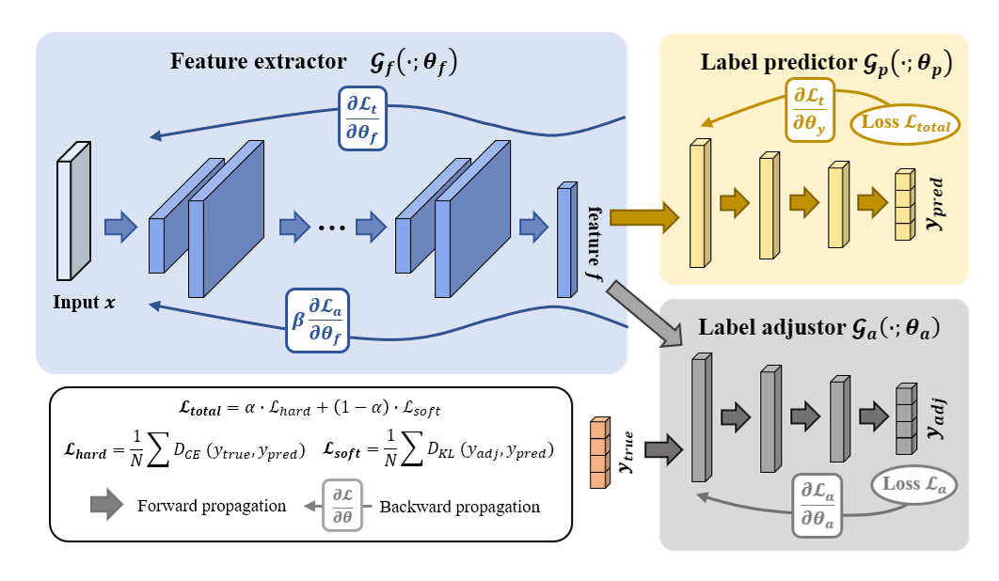

# Domain-Generalization-by-Dynamic-Label-Smoothing-Strategy-for-Biosignals-Classification
Code for the model in the paper Domain Generalization by Dynamic Label Smoothing Strategy for Biosignals Classification

# Datasets

>We evaluate the performance of our proposed dynamic label smoothing strategy on NinaPro DB1 datasets, which are open-access databases of Electromyography (EMG) recordings.

# Requirements

* Python 3.8
* Pytorch 1.11.0
* sklearn 0.24.0

# Function of file

* `prepare-for-ecai2023/models/feature_extractor.py`
  * feature extractor: The first component of our framework is responsible for extracting features from multi-channel time series data. Its architecture and inner workings will be detailed in an upcoming paper. The Feature Extractor plays a crucial role in transforming raw time series data into a more compact and informative representation that can be used by the following components.
* `prepare-for-ecai2023/models/label_predictor.py`
  * label predictor:
* `prepare-for-ecai2023/models/label_adjustor.py`
  * label adjustor:

# Usage
We've offered three models:  `Model1` , `Model2` and `Model3`
You need to use a tensor with shape: **[Batch_size, channel, length]** for all the three models.
